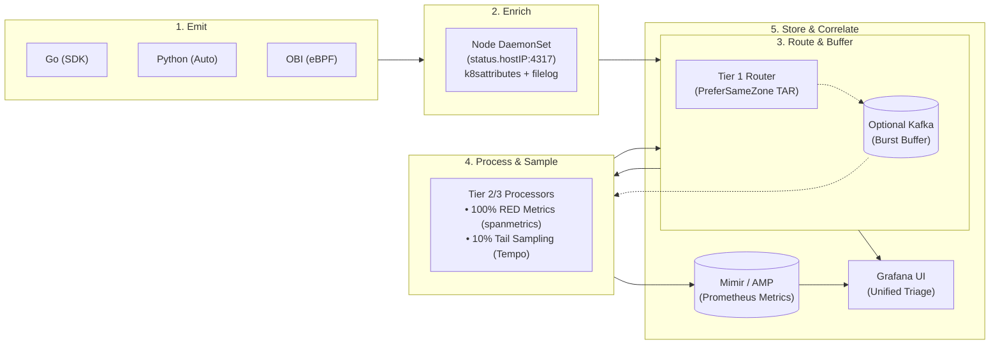

# OpenTelemetry Observability Platform on EKS

A reference enterprise observability platform on Amazon EKS: application teams emit vendor-neutral OTLP telemetry to node-local agents and a central two-tier OpenTelemetry Gateway fleet, while the platform team centrally manages enrichment, sampling, routing, retention, and FinOps costs.

By coupling tail-based sampling, S3 storage tiers, and serverless metric ingestion, this platform slashes observability spend by **70% to 90%** compared to commercial SaaS while eliminating vendor lock-in.

---

## Architecture
Deployable out-of-the-box in **Single-Cluster Mode (default, ~$150/mo)** using namespace and node-pool isolation, or in **Multi-Cluster Peered Mode (~$300/mo)** for regional hub aggregation across peered VPCs.


> 💡 **Multi-Cluster Regional Hub Extension:** For organizations running dozens of Kubernetes clusters or separate AWS accounts, the Gateway exposes an internal AWS Network Load Balancer (NLB) over VPC Peering or AWS Transit Gateway to aggregate regional telemetry into this central cluster without modifying workload code. 👉 *See [docs/architectural-decisions.md#3-cluster-topology-single-cluster-default-vs-multi-cluster-regional-hub](docs/architectural-decisions.md#3-cluster-topology-single-cluster-default-vs-multi-cluster-regional-hub) for the multi-cluster peered architecture diagram and full trade-off analysis.*

### The Telemetry Flow (In 5 Steps)



1. **Emit (Workloads):** Applications emit OTLP traces, metrics, and logs via Go SDK, OTel Operator auto-instrumentation, or zero-code Linux kernel eBPF.
2. **Enrich (Node DaemonSet):** The node-local collector receives telemetry via Downward API `status.hostIP:4317`, injects Kubernetes metadata (`k8sattributes`), tails pod logs, and batches data.
3. **Route & Buffer (Tier 1 Gateway):** Stateless routers use Topology Aware Routing (`PreferSameZone`) to eliminate cross-AZ transfer fees, with optional Kafka buffering to survive 10x traffic bursts.
4. **Process & Sample (Tier 2/3 Processors):** Consistent hashing converges distributed spans to calculate 100% accurate RED metrics (`spanmetrics`), while tail-sampling drops 90% of healthy traces to save S3 storage.
5. **Store & Correlate (S3 & LGTM/AMP):** Metrics stream to self-hosted Mimir (or serverless AWS AMP via toggle), logs and sampled traces write to S3 via free Gateway VPC Endpoints ($0.00/GB transfer), unified in Grafana with 1-click trace-to-log navigation.

---

## 💰 FinOps ROI: Slashing Observability Spend by 70–93%

> ⚠️ **The 2,000–5,000 QPS Rule (When to NOT Build This Platform):**
> If your application traffic is under **2,000 to 5,000 QPS**, **do NOT build or self-host this platform.** The engineering labor of operating Kubernetes nodes, stateful storage, and version upgrades outweighs cloud savings. At that scale, stay with **Datadog, Grafana Cloud, or AWS CloudWatch**. Self-hosting delivers massive positive ROI once application traffic exceeds **10,000–20,000 QPS**.

### Cost Comparison by Application QPS Scale

*Assumes industry-standard telemetry fan-out: **1 App QPS ≈ 8 Spans + 2 Logs (10 events/sec)**. 14-day retention for Traces/Logs, 30-day for Metrics.*

| Application Scale | Commercial SaaS (Datadog / Dynatrace) | This Platform (EKS OTel) | Annual Savings | Strategic Recommendation |
| :--- | :--- | :--- | :--- | :--- |
| **< 2,000 QPS** | ~$1,500 – $6,200 / mo | **~$1,000 / mo** | Break-even | 🛑 **Stay with SaaS / CloudWatch** (labor cancels savings) |
| **20,000 QPS** | ~$30,000 – $60,000 / mo | **~$4,660 / mo** | **+$304k – $664k / yr** (88% saved) | 🚀 **Build & Deploy** (ROI within 2 months) |
| **50,000 QPS** | ~$100,000 – $146,000 / mo | **~$9,710 / mo** | **+$1.08M – $1.63M / yr** (91% saved) | 🚀 **Sweet Spot** (mandatory self-hosting) |
| **100,000+ QPS** | $250,000+ / mo ($3.0M+/yr) | **~$18,320 / mo** | **+$2.78M+ / yr** (93% saved) | 🏢 **Enterprise Scale** (tens of millions saved) |

<details>
<summary><b>🔍 Click to view Monthly Infrastructure Cost Breakdown (Compute, S3, Network, Metrics)</b></summary>

| Application Scale | Compute (EKS Spot/OD) | S3 Storage (Loki/Tempo) | Inter-AZ Network (TAR) | Metrics (AMP / Mimir) | Total Platform Cost |
| :--- | :--- | :--- | :--- | :--- | :--- |
| **< 2,000 QPS** | ~$800 / mo | ~$30 / mo | ~$20 / mo | ~$150 / mo | **~$1,000 / mo** |
| **20,000 QPS** | ~$3,080 / mo *(50% Spot)* | ~$350 / mo | ~$280 / mo | ~$950 / mo | **~$4,660 / mo** |
| **50,000 QPS** | ~$6,160 / mo *(50% Spot)* | ~$850 / mo | ~$700 / mo | ~$2,000 / mo | **~$9,710 / mo** |
| **100,000+ QPS** | ~$12,320 / mo *(50% Spot)* | ~$1,600 / mo | ~$1,400 / mo | ~$3,000 / mo | **~$18,320 / mo** |

</details>

<details>
<summary><b>📊 Click to view Telemetry Volume Assumptions & Modeling</b></summary>

| Application Scale | Ingestion Rate | Monthly Spans *(14-day)* | Monthly Logs *(14-day)* | Active Series *(30-day)* |
| :--- | :--- | :--- | :--- | :--- |
| **< 2,000 QPS** | < 20,000 events/sec | < 50M spans / mo | < 200 GB logs / mo | ~5,000 metrics |
| **20,000 QPS** | ~200,000 events/sec | ~415M spans / mo | ~2.0 TB logs / mo | ~25,000 metrics |
| **50,000 QPS** | ~500,000 events/sec | ~1.0B spans / mo | ~5.0 TB logs / mo | ~60,000 metrics |
| **100,000+ QPS** | ~1,000,000+ events/sec | ~2.1B spans / mo | ~10.0 TB logs / mo | ~120,000 metrics |

*Assumptions: 1 App QPS = 8 Spans + 2 Logs (10 events/sec). Retention: 14 days for traces & logs, 30 days for metrics. S3 list price: $0.023/GB-mo. Inter-AZ network charges assume $0.02/GB cross-AZ reduced by 90% via Topology Aware Routing (`PreferSameZone`).*

</details>

### Key FinOps Levers

| FinOps Lever | Technical Mechanism in this Repo | Cloud Cost Impact |
| :--- | :--- | :--- |
| **Tail-Based Sampling** | Tier 2/3 Gateway keeps 100% of errors/slow calls, samples healthy 200 OKs at 10% | **Cuts S3 trace storage fees by 90%** while `spanmetrics` keeps RED dashboard metrics 100% accurate. |
| **Topology Aware Routing** | `spec.trafficDistribution: PreferSameZone` forces DaemonSets to route to same-AZ Routers | **Slashes inter-AZ network tax by 90%** (saving $14,000/mo at 100k QPS from AWS $0.02/GB cross-AZ fee). |
| **Free S3 VPC Endpoints** | AWS Gateway VPC Endpoints for S3 configured across all VPC route tables | **$0.00/GB S3 upload transfer**, completely bypassing AWS NAT Gateway data processing fees ($0.045/GB). |
| **Loki Chunk Consolidation** | `chunk_target_size: 1.5MB`, `max_chunk_age: 2h` in Loki ingester Helm values | **Reduces S3 PUT API requests by up to 80%** ($0.005 / 1,000 PUTs). |

---

### 💡 Architectural FAQ: CloudWatch vs. Loki & When Kafka is Needed

#### 1. Why use Grafana Loki instead of sending EKS logs to CloudWatch?
| Dimension | AWS CloudWatch Logs | Grafana Loki on Amazon S3 (This Repo) |
| :--- | :--- | :--- |
| **Ingestion Cost** | **$0.50 per GB** ($1,000 / month for 2 TB) | **$0.00 ingestion fee** ($0.023/GB S3 storage = ~$46 / month for 2 TB) |
| **VPC Data Transfer** | Subject to NAT Gateway bandwidth ($0.045/GB) | **$0.00 / GB** via internal S3 Gateway VPC Endpoint |
| **Trace Correlation** | Manual text searches; no native span links | **1-Click TraceID navigation**: clicking a log line opens the Tempo trace waterfall |

#### 2. When is Kafka actually needed vs. Direct Mode?
* **Direct Ingestion (Default, $0 extra cost, <50ms latency):** In 95% of deployments, OTel Gateways push directly to Loki, Tempo, and AMP with in-memory retry queues. Stay with direct mode if traffic is below 20K QPS.
* **Kafka Buffer (Enabled for >20K QPS, High Bursts, or SIEM):**
  1. **Prevents Kubelet Node Log Rotation Data Loss:** At 20k QPS, kubelet's node log buffer (50 MiB per container) fills and rotates in <60 seconds. Kafka allows DaemonSets to drain logs at sub-millisecond latency, preventing uncollected logs from being deleted during gateway or S3 slow-downs.
  2. **Extreme Outage & Spike Smoothing:** Absorbs 5x–10x traffic surges with 24–72h durable disk persistence on EBS gp3.
  3. **Multi-Consumer SIEM Fan-Out:** Streams identical telemetry simultaneously to Loki (developers) and OpenSearch/Splunk (security compliance).

---

## 🏛️ Core Platform Capabilities

* **The 4 Levels of Telemetry Instrumentation:** Combines Linux kernel eBPF (catches instant `OOMKilled` Exit 137 and cross-AZ TCP drops), runtime auto-instrumentation (OTel Operator for Python/Java/Node.js stack traces and SQL queries), programmatic Go SDK (`telemetry.go`), and SaaS export. 👉 **[Read Instrumentation Guide](observability-as-a-product/onboarding/instrumentation-tiers-and-ebpf.md)**.
* **Dual-Pipeline Spanmetrics & 10% Tail Sampling:** Fans out raw traces into two parallel paths: 100% of spans feed the `spanmetrics` connector for exact RED metrics, while tail-sampling retains 100% of errors and 10% of healthy calls for S3 storage.
* **Two-Tier Consistent Hashing:** Stateless routers hash `trace_id` to route all spans of a distributed trace to the exact same stateful processor replica, guaranteeing complete trace assembly without data loss.
* **Self-Hosted Mimir & Serverless AMP:** Evaluates SLO burn-rate alerts locally via in-cluster Mimir Ruler by default, with an opt-in toggle (`use_amazon_managed_prometheus = true`) to eliminate 10 stateful pods and cut cluster memory requests by **~1.9 GiB** using AWS SigV4.
* **Google SRE Multi-Window SLO Alerting:** Evaluates 14.4x, 6x, 3x, and 1x error budget burn rates against RED metrics, paging on-call engineers via AWS Systems Manager Incident Manager for critical fast burns and ticket sinks for slow burns.
* **Out-of-Band Meta-Monitoring:** Collector self-telemetry (`:8888`/`:8889`) monitors data drops and backpressure, paired with an external AWS CloudWatch + SNS watchdog for total cluster failure. 👉 **[Read Meta-Monitoring Guide](observability-as-a-product/dashboards-and-alerts/META_MONITORING.md)**.
* **Multi-Tenancy Access Control & Quotas:** Physical S3 prefix partitioning (`X-Scope-OrgID`), Grafana Organizations mapped to corporate SSO, and FinOps stream limits. 👉 **[Read Multi-Tenancy Architecture](docs/multi-tenancy.md)**.

---

## 🤖 AIOps & Autonomous SRE Agent Foundation

This platform serves as the production telemetry and diagnostic target for autonomous SRE agents:

* **Zero-Code Cluster Triage (`k8sgpt`):** CNCF sandbox AI engine evaluating live cluster health, catching pod OOMKills, crash loops, and failed readiness probes in plain English with zero custom code. 👉 *See [Terminal Session](observability-as-a-product/aiops/demos/k8sgpt-terminal-session.md) and [Analysis JSON](observability-as-a-product/aiops/demos/k8sgpt-analysis.json).*
* **Measured Adopt Baseline (`HolmesGPT`):** Robusta's open-source multi-source root cause investigation tool configured against this cluster's Prometheus, Loki, Tempo, and Kubernetes events to benchmark autonomous agent accuracy. 👉 *See [HolmesGPT Configuration](observability-as-a-product/aiops/holmesgpt/).*
* **Autonomous SRE Agent Foundation ([`sre-agent-guardrails`](https://github.com/ok-karthik/sre-agent-guardrails) — *Coming Soon / In Development*):**
  This platform provides the production telemetry, diagnostic RBAC, and alert routing foundation for the upcoming autonomous SRE agent:
  - **Read-Only RBAC:** Dedicated `sre-agent` identity with read-only verbs across `default` and `observability` namespaces ([`sre-agent-rbac.yaml`](observability-runtime/sre-agent-rbac.yaml)).
  - **Additive Alertmanager Webhook:** Routes `severity=~"page|ticket"` alerts to the agent with `continue: true` to preserve human on-call escalation.
  - **Reserved Audit Streams:** Agent diagnostic actions and GenAI traces land in Loki and Tempo tagged with `service.name=sre-agent` and `tenant.id=platform-aiops`.
* **FinOps Telemetry Cost Engine:** Standalone analyzer querying live Mimir PromQL ingestion vectors, calculating per-tenant and per-service S3 storage and processing spend ([`cost-analyzer.py`](observability-as-a-product/aiops/finops/cost-analyzer.py)).

---

## Where Things Live

| Path | Contents | Status |
|---|---|---|
| [`workloads/`](workloads/) | App-team-owned microservices (Go/Python SDK & manifests) and OTel DaemonSet agent | **Deployed** |
| [`observability-runtime/`](observability-runtime/) | Central OTel Gateway, Ingestion NLB, Grafana ALB, alert sink, and SRE agent RBAC | **Deployed** |
| [`observability-as-a-product/`](observability-as-a-product/) | Service onboarding contracts, 4 levels of instrumentation, sampling policies & GitOps | *Product Paved Roads* |
| [`observability-as-a-product/aiops/`](observability-as-a-product/aiops/) | AIOps baselines (k8sgpt, HolmesGPT) and FinOps telemetry cost allocation engine | **Deployed** |
| [`terraform/`](terraform/) | Root orchestrator for 1-click full deployment or standalone EKS platform | **Deployed** |
| [`terraform/local/`](terraform/local/) | Local portability profile: zero-AWS cluster provisioning (MinIO S3 + native template rendering) | **Deployed** |
| [`terraform/modules/eks-base/`](terraform/modules/eks-base/) | Day-1 Base Infrastructure (VPC `10.1.0.0/16`, EKS 1.35, Nodes, Karpenter, cert-manager, gp3) | **Deployed** |
| [`terraform/modules/observability-stack/`](terraform/modules/observability-stack/) | Day-2 "Bring Your Own Cluster" (BYOC) Observability Platform (AMP, S3, Loki, Tempo, Mimir, Grafana) | **Deployed** |
| [`terraform/modules/observability-stack/helm-values/`](terraform/modules/observability-stack/helm-values/) | Loki, Tempo, Mimir, and Grafana Helm values with inline architectural rationale | **Deployed** |
| [`docs/`](docs/) | Decisions, multi-tenancy, deployed inventory, portability guide, and archived plan | *Documentation* |
| [`.agents/AGENTS.md`](.agents/AGENTS.md) | Agent operational workflows, mental model, and failure traps | *Documentation* |

<details>
<summary>Full tree, annotated with what is deployed and what is a template</summary>

```text
docs/                               # Architectural decisions & traps
  architectural-decisions.md        # 7 core decisions & scale patterns
  scale-and-capacity-planning.md    # 2K to 200K QPS capacity matrix & tuning
  deployed-components.md            # Full Helm release & version inventory
  multi-tenancy.md                  # S3 isolation, Grafana Orgs, alerts
  portability.md                    # Local/sovereign cloud MinIO profile & chart traps
  aiops-portability-plan-archive.md # Archived 5-phase plan & buy-vs-build landscape
  future-roadmap.md                 # GenAI APM, IDP, & GitOps evolution

workloads/                          # App-team-owned microservices
  golang-app/                       # DEPLOYED  Go SDK source code, Dockerfile, Svc, Ingress
  python-app/                       # DEPLOYED  Python app source code, Dockerfile, Svc, CR
  otel-collector-daemonset.yaml     # DEPLOYED  Node agent + OBI eBPF (HostNetwork Downward API)

observability-runtime/              # Platform runtime manifests
  gateways/                         # DEPLOYED  Modular Two-Tier gateway fleet
    00-gateway-rbac.yaml            #   ClusterRole & bindings for discovery
    01-gateway-tier2-router.yaml    #   Tier 2 Stateless Router (Deployment)
    02-gateway-tier3-processor.yaml #   Tier 3 Stateful Processor (Spanmetrics + Tail Sampling)
  sre-agent-rbac.yaml               # DEPLOYED  Read-only RBAC for autonomous SRE agent
  grafana-ingress.yaml              # DEPLOYED  Internet-facing Grafana ALB
  grafana-dashboards-configmap.yaml # DEPLOYED  Baseline Grafana dashboards
  mimir-ruler-rules-configmap.yaml  # DEPLOYED  SLO burn-rate rule groups
  alert-sink.yaml                   # DEPLOYED  Ticket-severity echo receiver
  optional-extensions/              # TEMPLATE  Optional enterprise tier
    svc-nlb-otel-gateway.yaml       #   Cross-VPC multi-cluster Ingestion NLB
    kafka-stub.yaml                 #   In-cluster Kafka buffer stub
    opensearch-index-bootstrap-job.yaml # OpenSearch ISM policy

observability-as-a-product/              # Observability product paved roads & governance
  aiops/                                # DEPLOYED  AIOps baselines & FinOps engine
    demos/                              #   k8sgpt zero-code cluster diagnosis
    holmesgpt/                          #   HolmesGPT OSS evaluation baseline
    finops/                             #   FinOps PromQL cost allocation script
  onboarding/                           #   Identity & SLO contract, 4 tiers
    service-onboarding-contract.md
    instrumentation-tiers-and-ebpf.md
    instrumentation-manifests/          #   Multi-runtime CRs & Go SDK template
  gateway-policies/                     #   Policy templates
    otel-gateway-multitenant.yaml       #   Multi-tenant routing connector
    otel-gateway-tail-sampling.yaml     #   Tail sampling cost budgeting
  dashboards-and-alerts/                #   SRE math & rule generator
    golden-signals/                     #   Raw JSON definitions
    helm-chart/                         #   PrometheusRule Helm chart
    META_MONITORING.md                  #   Meta-monitoring architecture
  argocd/                               #   GitOps App-of-Apps template
    root-application.yaml               #   Root Application CR
    appproject-platform.yaml            #   Platform AppProject
    apps/                               #   Child application manifests

terraform/                              # Cloud infrastructure & Platform modules
  main.tf                               # Root orchestrator (1-Click demo entrypoint)
  variables.tf / outputs.tf
  local/                                # DEPLOYED  Local Portability Profile (MinIO S3)
    deploy-local.sh / destroy-local.sh  #   Local bootstrap & teardown scripts
    minio.yaml                          #   MinIO S3 deployment & bucket-init Job
    render-values.py                    #   Native Terraform templatefile() runner
    render/main.tf                      #   Headless rendering module
    overlays/                           #   Local MinIO Helm value overlays
  modules/
    eks-base/                           # Day-1 Base Infrastructure
      network.tf                        #   VPC (10.1.0.0/16), Subnets, S3 VPC Endpoint
      eks.tf                            #   EKS 1.35, Managed Node Group
      addons.tf                         #   cert-manager, aws-lb-controller, karpenter
      cluster-storage/                  #   gp3 StorageClass baseline
      karpenter-provisioner/            #   Karpenter NodePool & EC2NodeClass
    observability-stack/                # Day-2 "Bring Your Own Cluster" (BYOC) Module
      amp.tf                            #   Amazon Managed Prometheus & Pod Identity
      storage.tf                        #   S3 buckets (Loki/Tempo/Mimir) & IAM
      meta-monitoring.tf                #   External Dead-Man's SNS pager
      helm-charts.tf                    #   Loki, Tempo, Mimir, Grafana, OpenSearch
      helm-values/                      #   Loki/Tempo/Mimir/Grafana Helm values
```

</details>

---

## Decisions and Trade-Offs

| Decision | Chosen Approach | Rejected Alternative | Cost of the Choice |
|---|---|---|---|
| **Collector Topology** | DaemonSet agent + central two-tier gateway | Sidecar-per-pod; agent-only | Additional network hop; fleet to operate |
| **Sampling Strategy** | Tail-based sampling at Tier 2 gateway | Head sampling in the SDK | Stateful gateway; trace-ID affinity required |
| **Cluster Layout** | Single-cluster (dev) / Peered multi-cluster (prod) | Single cluster for everything | VPC peering complexity; extra control plane |
| **Telemetry Backends** | Self-hosted Mimir + S3 Loki/Tempo | Serverless AMP | Retains in-cluster ruler-based SLO evaluation; AMP is an opt-in (`use_amazon_managed_prometheus = true`) |
| **Agent Addressing** | Node-local `status.hostIP` via Downward API | Collector ClusterIP Service | Workloads declare hostIP Downward API block |
| **Log Architecture** | Loki-first (with optional Kafka $\rightarrow$ OpenSearch) | OpenSearch / ELK for everything | Query syntax differences; dual-path maintenance |
| **Alerting & Escalation** | Google SRE SLO burn-rate alerts + AWS SSM Incident Manager | Self-hosted in-cluster pager (GoAlert); unmaintained Grafana OnCall | Serverless AWS managed service with multi-region replication |

👉 *For deep dives into each choice, upstream Helm chart traps, and operational details, read [Architectural Decisions & Trade-Offs Deep Dive](docs/architectural-decisions.md).*

---

## Portability: other clouds, EU sovereign clouds, on-prem

The platform is built in two layers, and only the bottom one is AWS-specific.

| Layer | Portable? | What changes off AWS |
|---|---|---|
| **Telemetry contract:** OTLP from apps, `service.name`/`tenant.id` semantics, the 4-tier instrumentation model | Yes, as is | Nothing. Apps never learn which backend they write to |
| **Kubernetes layer:** OTel operator, DaemonSet agents, two-tier gateway fleet, OBI eBPF, Loki/Tempo/Mimir Helm charts, Grafana dashboards, SLO burn-rate rules | Yes, as is | Nothing, except the ingest `Service` annotations (the NLB in `optional-extensions/` becomes that provider's LB, or MetalLB on-prem) |
| **Object storage:** Loki/Tempo/Mimir chunks | Yes | Bucket endpoint + credentials. Any S3-compatible store works (MinIO on-prem; STACKIT, IONOS, OVHcloud, Hetzner object storage). Azure Blob and GCS are native backends in all three charts |
| **Identity:** Pod Identity / IAM roles for the S3 writers | Provider-specific | Workload Identity (GKE/AKS) or static S3 keys in a Secret (MinIO / sovereign clouds) |
| **Managed services:** AMP, SSM Incident Manager + SNS, CloudWatch datasource, `10-aws-infrastructure-triage` dashboard | AWS only | Self-hosted Mimir (already the default: `use_amazon_managed_prometheus = false`), Alertmanager webhook to your pager, drop the CloudWatch datasource |
| **Terraform:** `terraform/modules/eks-base`, `observability-stack` | AWS only | One Terraform root per provider, same Helm values. The Kubernetes layer is not re-implemented |

**Status:** End-to-end verified on AWS EKS and locally via the kind/k3d/orbstack + MinIO portability profile (`make local-create`). All telemetry signals (distributed traces in Tempo, structured logs in Loki, Prometheus metrics in Mimir) flow continuously from workloads, and Mimir Ruler evaluates SLO burn-rate rules and delivers alerts to `alert-sink`. Both environments consume the exact same base Helm values (`terraform/modules/observability-stack/helm-values/*.tftpl`) rendered natively via Terraform `templatefile()`, with local overlays for path-style MinIO S3 endpoints and static credentials. See [docs/portability.md](docs/portability.md) for architectural seams, chart traps, and verified acceptance checklist.

---

## What Is Not Implemented
 
Stated plainly, because these read as features if you only skim the directory tree:

- **Multi-tenant routing** — [`observability-as-a-product/gateway-policies/otel-gateway-multitenant.yaml`](observability-as-a-product/gateway-policies/otel-gateway-multitenant.yaml) is a governance template. The deployed gateway currently routes to a single default tenant.
- **The dashboard-and-alert generator chart** — [`observability-as-a-product/dashboards-and-alerts/helm-chart/`](observability-as-a-product/dashboards-and-alerts/helm-chart/) is a reusable Helm chart generating Kubernetes Prometheus rule definitions. Deployed golden-signal dashboards run directly in Grafana via ConfigMaps.
- **GitOps** — [`observability-as-a-product/argocd/`](observability-as-a-product/argocd/) contains an Argo CD App-of-Apps template. Active deployment in this repository is orchestrated directly via Terraform & Makefile.
- **Gateway autoscaling** — The Tier 2 Router runs with `minReplicas: 3` and `topologySpreadConstraints` (guaranteeing 1 pod per Availability Zone for same-zone routing). Standard CPU HPA is declared, but without Kubernetes `metrics-server` installed, the replica count is effectively fixed at 3. For traffic-spike autoscaling based on incoming spans/sec, an optional KEDA `ScaledObject` template is provided in [`observability-runtime/optional-extensions/keda-otel-autoscaler.yaml`](observability-runtime/optional-extensions/keda-otel-autoscaler.yaml).
- **Enterprise Buffering & SIEM (Kafka / OpenSearch)** — Provided as modular optional templates in [`observability-runtime/optional-extensions/`](observability-runtime/optional-extensions/). Direct ingestion to S3 Loki, Tempo, and AMP is enabled by default.
- **Transport security** — Every internal OTLP hop sets `tls.insecure: true`. The ingest NLB is internal, but the Grafana ALB is internet-facing on plain HTTP with no TLS and no SSO (fine for a sandbox/demo; production requires an ACM certificate + AWS Cognito or corporate SAML SSO).
- **Terraform state** — Local only (`terraform.tfstate`). Production should configure a remote S3 backend with DynamoDB state locking.

---

## How to Run It

### Prerequisites

- AWS credentials with Admin/PowerUser permissions (`aws configure`). Region defaults to `us-east-1`.
- `kubectl` 1.23+, `terraform` 1.5.0+, `helm` 3.x, `python3`.
- Demo application images are publicly hosted on Docker Hub (`okkarthik/*`). No manual image builds or ECR logins are needed.

### Cost Warning

* **Single-Cluster Mode (`SINGLE_CLUSTER=true`, default):** Roughly **~$150/month (~$0.20/hour)**. Uses 1× EKS control plane, 1× NAT gateway, serverless AMP metrics, 2× `t3.large` spot nodes, and free S3 Gateway VPC endpoints.
* **Multi-Cluster Peered Mode (`SINGLE_CLUSTER=false`):** Roughly **~$300/month (~$0.40/hour)**. Uses 2× EKS control planes, 2× NAT gateways, cross-VPC peering, and 2 separate node groups.

`us-east-1` list prices, excluding data transfer; spot prices vary. **Destroy it when you are done.**

### Deploy

#### Option A: Offline / Sovereign Cloud Local Profile (Free, Zero-AWS)
Run the full observability stack locally on OrbStack, kind, or k3d with MinIO S3 object storage:

```bash
make local-create      # provisions local cluster, MinIO S3, and deploys full stack
make local-destroy     # tears down local cluster and storage
```

#### Option B: AWS EKS Cloud Mode
Deploy the production-grade platform on AWS EKS:

```bash
make k8s-create        # two-stage apply in Single-Cluster mode (~$150/mo, fastest)
# OR: make k8s-create SINGLE_CLUSTER=false  # dual-cluster peered topology (~$300/mo)

make k8s-context       # configure kubeconfig contexts
make k8s-deploy-all    # deploy gateway, collectors, and workloads
```

### Access & Verify

```bash
make k8s-dashboards    # port-forward Grafana to http://localhost:3000
make grafana-password  # fetch generated admin password (user: admin)
make k8s-status        # check pod health across namespaces
```

Generate traffic through the demo services:

```bash
# In Single-Cluster mode (default):
ALB=$(kubectl --context observability-cluster get ingress app-ingress -o jsonpath='{.status.loadBalancer.ingress[0].hostname}')

# In Multi-Cluster mode:
# ALB=$(kubectl --context apps-workload-cluster-1 get ingress app-ingress -o jsonpath='{.status.loadBalancer.ingress[0].hostname}')

while true; do curl -s "http://$ALB/product" > /dev/null; sleep 1; done
```

### Tear Down

```bash
make k8s-destroy
```

---

## 📦 Deployed Stack at a Glance

* **Metrics Backend:** Self-hosted Mimir (default with in-cluster Ruler SLO burn-rate evaluation) or Serverless Amazon Managed Prometheus (AMP opt-in via SigV4).
* **Logs Backend:** Grafana Loki (SingleBinary) — native OTLP on Amazon S3 via Free S3 Gateway VPC Endpoints ($0.00/GB data transfer).
* **Traces Backend:** Grafana Tempo (Monolithic) — distributed tracing on Amazon S3 via Free S3 Gateway VPC Endpoints.
* **Unified UI:** Grafana (10.5.15) — single pane of glass linking PromQL, LogQL, and TraceQL.
* **Gateway Fleet:** Central OTel Gateway — Tier 1 consistent-hash router + Tier 2 tail-sampling processor.
* **Node Agents:** OTel Collector DaemonSet (`k8sattributes`, `filelog`) + OBI eBPF (kernel TCP & HTTP RED visibility).
* **Alerting Engine:** AWS Systems Manager Incident Manager (multi-region escalation) + Alert Sink webhook (warning tickets).
* **AIOps & SRE Agent Readiness:** k8sgpt zero-code triage, HolmesGPT evaluation baseline, SRE agent RBAC ([`sre-agent-rbac.yaml`](observability-runtime/sre-agent-rbac.yaml)), and FinOps telemetry cost analyzer.
* **Local Portability Profile:** Zero-AWS offline profile via MinIO S3 and native Terraform templatefile rendering (`make local-create`).

👉 *For the full version-pinned Helm release inventory, pod counts, and optional components (Mimir, Kafka, OpenSearch), see **[docs/deployed-components.md](docs/deployed-components.md)**.*

---

## Screenshots

### Go service — golden signals


### Python service — golden signals


### Distributed trace across both services (Tempo)


### Log-to-trace correlation (Loki)

