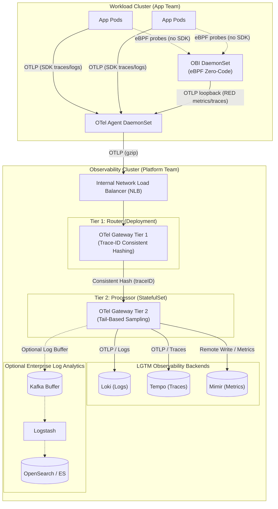

# OpenTelemetry Observability Platform on EKS

A working multi-cluster observability platform on Amazon EKS: application teams emit OTLP and get traces, metrics, and logs correlated in Grafana, while the platform team owns enrichment, sampling, routing, retention, and cost in one place instead of in every service.

The problem it solves is ownership. Without a platform layer, every team picks its own agent, its own sampling rate, and its own backend, and the observability bill grows linearly with traffic while nobody can follow a request across two services. Here, applications declare *what* they are (`service.name`, `team`, `deployment.environment`) and the platform decides *where telemetry goes, what survives sampling, and how long it is kept*.

Everything below is deployed by the code in this repository. Where something is a template rather than a running component, it is marked **not implemented** — see [What is not implemented](#what-is-not-implemented).

---

## Enterprise Architecture Patterns

This platform has been upgraded to implement enterprise-grade observability patterns:

1. **eBPF Zero-Code Instrumentation (OBI):** A dedicated `obi-agent` DaemonSet uses [OpenTelemetry eBPF Instrumentation](https://opentelemetry.io/docs/zero-code/obi/) to natively capture RED (Rate, Errors, Duration) metrics and traces from the kernel, with no SDK in the target process. OBI is a separate upstream project from the Collector — there is no `obi` receiver in the `opentelemetry-collector-contrib` image, so it cannot be configured as a receiver on `otel-collector-agent` without building a custom Collector binary via OCB. It runs as its own process instead, forwarding OTLP to the node-local Collector over loopback so its telemetry still gets `k8sattributes`-equivalent enrichment (self-attached, since connection-based pod association can't see loopback traffic), `team` tagging, and gateway routing.
2. **Two-Tier Gateway (Consistent Hashing):** The central OTel Gateway is split into two tiers:
   - **Tier 1 (Router):** A Deployment that hashes trace traffic by `traceID` and routes it.
   - **Tier 2 (Processor):** A StatefulSet that receives the hash-aligned traces. This guarantees every span for a trace lands on the exact same replica, enabling accurate **tail-based sampling**.
3. **Log Architecture (Loki-First + Optional Kafka/ELK Analytics):** All container and application logs are ingested natively into **Loki** over OTLP (`otlphttp/loki`), providing lightweight, S3-backed storage and sub-second trace-to-log correlation in Grafana. The repository also includes a fully configured optional enterprise extension with Kafka buffering and Logstash $\rightarrow$ OpenSearch (with ISM rollover policies and attribute flattening) for arbitrary free-text indexing. See [Decision 8](docs/architectural-decisions.md#8-loki-first-logging-with-optional-kafkaelk-analytics).
4. **Network & Latency Optimization (OTLP Compression & Topology Routing):** Ingestion pipelines across the DaemonSet agent and Gateway tiers enforce `compression: gzip` on OTLP data streams (cutting cross-AZ and cross-cluster egress bandwidth by ~80%) and enable Kubernetes Topology Aware Routing (`service.kubernetes.io/topology-mode: Auto`) on the Ingestion NLB.
5. **SLO Burn-Rate Alerting:** Mimir's ruler and Alertmanager run multi-window, multi-burn-rate SLO alerts (the Google SRE Workbook pattern) against both demo services' RED metrics — a fast 5xx spike pages within minutes, a slow leak opens a ticket instead. `page`-severity alerts route to **GoAlert**, a self-hosted on-call/escalation tool — Alertmanager can route and dedupe, but has no concept of an on-call rotation or an escalation chain. See [Decision 7](docs/architectural-decisions.md#7-slo-burn-rate-alerts-in-the-observability-layer-not-the-app) and [Decision 9](docs/architectural-decisions.md#9-goalert-for-incident-escalation).
6. **Meta-Monitoring (Monitoring the Monitoring):** The platform instruments itself. Collectors expose their own internal Prometheus metrics on `:8888` and `:8889` which are scraped and fed into Mimir. Mimir evaluates alerts on `otelcol_receiver_refused_*` (backpressure), `otelcol_processor_dropped_*` (data loss), and flatline detection (silent failures). A decoupled external CloudWatch alarm combined with an SNS pager topic guarantees alerts fire even if the entire EKS observability cluster goes down. See [META_MONITORING.md](observability-platform/03-dashboards-and-alerts/META_MONITORING.md).

## Architecture



Two EKS clusters (Kubernetes 1.35, `us-east-1`) in peered VPCs — `10.0.0.0/16` for workloads, `10.1.0.0/16` for observability. Lightweight collectors run next to workloads; a central two-tier gateway fleet on the observability cluster owns policy; logs are buffered by Kafka before shipping to ELK, while traces and metrics persist to LGTM backends.

## The telemetry path

1. **A Go service calls a Python service** and propagates W3C trace context. Go uses the OTel SDK programmatically (`telemetry.go`); Python is auto-instrumented by the OTel Operator through a pod annotation. Both print `trace_id=` into stdout logs.
2. **Each pod exports OTLP to the collector on its own node**, resolved through the Downward API (`status.hostIP:4317`) — not through a ClusterIP Service. This is load-bearing; see [Decision 5](docs/architectural-decisions.md#5-node-local-routing-via-statushostip).
3. **The DaemonSet agent enriches and forwards.** It receives OTLP, tails `/var/log/pods` via `filelog`, scrapes `kubeletstats`, attaches `k8s.*` attributes via `k8sattributes`, stamps `team=product`, batches, and ships everything to the regional gateway over an internal NLB.
4. **The gateway applies platform policy.** `memory_limiter`, health-check and noisy-span filters, OTTL semantic-convention normalization, trace-ID-affinity load balancing, then `tail_sampling`, then `batch`.
5. **Backends store, Grafana correlates.** Traces to Tempo, metrics to Mimir via Prometheus remote-write, logs to Loki over native OTLP — all on S3 with 7-day retention. Grafana links logs to traces (`derivedFields` on `trace_id`) and traces back to logs and metrics (`tracesToLogsV2`, `tracesToMetrics`).

## What actually gets deployed

### Observability cluster

| Component | Chart / image | Version | Shape |
|---|---|---|---|
| Loki | `grafana/loki` | 7.2.0 | SingleBinary, 1 pod, S3 |
| Tempo | `grafana/tempo` | 1.24.4 | monolithic, 1 pod, S3 |
| Mimir | `grafana/mimir-distributed` | 6.1.0 | 10 pods, 1 replica each, S3 (incl. ruler + alertmanager) |
| Grafana | `grafana/grafana` | 10.5.15 | 1 pod, 3 datasources |
| OTel Gateway (Tier 1 & 2) | `otel/opentelemetry-collector-contrib` | 0.156.0 | Deployment & StatefulSet |
| Kafka Stub | `bitnami/kafka` | 3.6 | 1 pod |
| OpenSearch | `opensearch-project/opensearch` | 3.8.0 | 1 pod (`singleNode`), security plugin disabled, gp3 PVC |
| OpenSearch Dashboards | `opensearch-project/opensearch-dashboards` | 3.8.0 | 1 pod |
| Logstash | `elastic/logstash` | 8.5.1 | 1 pod, Kafka → OpenSearch |
| GoAlert | `goalert/goalert` (digest-pinned) | v0.34.1 | 1 pod + Postgres StatefulSet |
| Alert sink | `mendhak/http-https-echo` | 31 | 1 pod — webhook receiver for `ticket`-severity alerts |
| OTel Operator | `opentelemetry-operator` | 0.120.0 | 1 pod |
| cert-manager | `jetstack/cert-manager` | v1.21.1 | 3 pods |
| AWS LB Controller | `eks/aws-load-balancer-controller` | 3.4.3 | ALB + NLB |
| Karpenter | `oci://public.ecr.aws/karpenter` | 1.0.6 | NodePool + EC2NodeClass |
| gp3 StorageClass | local chart `cluster-storage/` | — | installed before any PVC |

Mimir runs distributor, ingester, querier, query-frontend, query-scheduler, store-gateway, compactor, gateway, ruler, and alertmanager — one replica each. Overrides-exporter, rollout-operator, MinIO, and the bundled Kafka are disabled.

Node group: 2× `t3.large` spot (min 2, max 6), plus Karpenter for burst. Measured request footprint of the trimmed stack is ~2.2 vCPU / ~6.4 GiB.

### Workload cluster

| Component | Version | Notes |
|---|---|---|
| OTel Collector agent | contrib 0.156.0 | DaemonSet, `hostNetwork: true` |
| OBI (eBPF instrumentation) | `otel/ebpf-instrument` v0.12.2 | DaemonSet, `hostPID: true` + `hostNetwork: true`, forwards to the agent over loopback |
| OTel Operator | 0.120.0 | injects Python auto-instrumentation |
| cert-manager | v1.21.1 | webhook TLS for the operator |
| AWS LB Controller | 3.4.3 | ALB for the demo app |
| Go + Python demo services | — | built and pushed to ECR by GitHub Actions |

Node group: 2× `t3.medium` spot (min 1, max 4). No Karpenter — two app pods and a DaemonSet fit a single node group.

### AWS

Five S3 buckets (Loki, Tempo, Mimir blocks/ruler/alertmanager). The alertmanager bucket holds Alertmanager's runtime state (silences, notification log); the ruler bucket is provisioned but unused — Mimir's ruler reads SLO rule groups from a mounted ConfigMap instead (see [Decision 7](docs/architectural-decisions.md#7-slo-burn-rate-alerts-in-the-observability-layer-not-the-app)). One IAM role reached through **EKS Pod Identity** associations, one NAT gateway per VPC, one internal NLB for OTLP ingest, one internet-facing ALB for Grafana, five 10 GiB gp3 volumes, one 1 GiB gp3 volume for Alertmanager, one 10 GiB gp3 volume for OpenSearch, one 5 GiB gp3 volume for GoAlert's Postgres. ECR repositories for both service images. CI authenticates to AWS via GitHub OIDC, not static keys.

### Where things live

| Path | Contents |
|---|---|
| `docs/` | Deep-dive architectural decisions, trade-offs, and chart trap references |
| `terraform/` | Both clusters, VPC peering, AWS external Meta-Monitoring, S3, IAM |
| `terraform/observability-cluster/helm-values/` | Loki / Tempo / Mimir / Grafana values, with the reasoning inline |
| `apps-workload-cluster-1/` | Demo services, their manifests, the DaemonSet collector |
| `observability-platform/k8s-manifests/` | Gateway, NLB, Grafana ingress, dashboards — the deployed platform |
| `observability-platform/01-…04-…/` | Onboarding contract, policy templates, dashboard generator, GitOps baseline |
| `.agents/AGENTS.md` | Long-form conventions and chart traps |
| `architecture-decisions-and-tradeoffs.md` | Five collector topology patterns compared, with diagrams |

<details>
<summary>Full tree, annotated with what is deployed and what is a template</summary>

```text
docs/                               # deep-dive architectural decisions, trade-offs, and chart traps
  architectural-decisions.md
apps-workload-cluster-1/            # app-team-owned; reason about it as its own repo
  apps-src/
    golang-app/                     # Go service, programmatic OTel SDK (telemetry.go)
    python-app/                     # Python service, Operator auto-instrumentation
  k8s-manifests/
    otel-collector-daemonset.yaml   # DEPLOYED  agent + OBI eBPF DaemonSet + ExternalName alias + RBAC
    golang-app/                     # DEPLOYED  Deployment, Service, ALB Ingress
    python-app/                     # DEPLOYED  Deployment, Service, Instrumentation CR

observability-platform/             # platform-team-owned; the product surface
  k8s-manifests/                    # DEPLOYED  everything the Makefile applies
    otel-collector-gateway.yaml     #   gateway CR: filters, OTTL, tail sampling, exporters
    svc-nlb-otel-gateway.yaml       #   internal NLB, instance target type
    grafana-ingress.yaml            #   internet-facing ALB, HTTP only
    grafana-dashboards-configmap.yaml
    mimir-ruler-rules-configmap.yaml #  SLO burn-rate PrometheusRule-style groups, mounted into the ruler
    alert-sink.yaml                 #   webhook echo receiver for ticket-severity alerts
    goalert.yaml                    #   on-call/escalation for page-severity alerts, + its Postgres
    opensearch-index-bootstrap-job.yaml #  index template + ISM policy for the ELK path
  01-app-onboarding/                # TEMPLATE  contract + per-language values and CRs
  02-gateway-configuration/         # TEMPLATE  tenant routing, real sampling budget
  03-dashboards-and-alerts/
    golden-signals/                 # DEPLOYED  via the ConfigMap above
    helm-chart/                     # TEMPLATE  needs Prometheus Operator CRDs
  04-cluster-gitops-baseline/       # TEMPLATE  Argo CD app-of-apps; Argo CD not installed

terraform/
  main.tf                           # both cluster modules + VPC peering and routes
  apps-workload-cluster-1/          # EKS, VPC, ECR, cert-manager/Operator/LB controller
  observability-cluster/            # EKS, VPC, S3, IAM, Pod Identity, full LGTM stack
    helm-values/                    # Loki/Tempo/Mimir/Grafana .tftpl, reasoning inline
    cluster-storage/                # gp3 StorageClass — installs before any PVC
    karpenter-provisioner/          # NodePool + EC2NodeClass
```

The per-app nesting under `k8s-manifests/` is why the Makefile uses `kubectl apply -R`
and `kubectl delete -R`; a non-recursive delete skips both app subdirectories and
leaves the Deployments and the ALB running.

</details>

## Decisions and Trade-Offs

A summary of core architectural decisions is listed below. For detailed rationale, rejected alternatives, and chart traps, see **[docs/architectural-decisions.md](docs/architectural-decisions.md)**.

| Decision | Chosen Approach | Rejected Alternative | Cost of the Choice |
|---|---|---|---|
| **Collector Topology** | DaemonSet agent + central two-tier gateway | Sidecar-per-pod; agent-only | Additional network hop; fleet to operate |
| **Sampling Strategy** | Tail-based sampling at Tier 2 gateway | Head sampling in the SDK | Stateful gateway; trace-ID affinity required |
| **Cluster Layout** | Dedicated observability EKS cluster in peered VPC | Single cluster, separate namespace | ~$73/mo extra control plane; VPC peering |
| **Telemetry Backends** | Self-hosted LGTM (S3-backed) | AMP + AMG or commercial SaaS | Managing four stateful open-source systems |
| **Agent Addressing** | Node-local `status.hostIP` via Downward API | Collector ClusterIP Service | Workloads declare hostIP Downward API block |
| **Log Architecture** | Loki-first (with optional Kafka $\rightarrow$ OpenSearch) | OpenSearch / ELK for everything | Query syntax differences; dual-path maintenance |
| **Alerting & Escalation** | Mimir Ruler SLO burn-rate + GoAlert | App-level alerts; unmaintained Grafana OnCall | Manual initial token bootstrap in GoAlert |

👉 *For deep dives into each choice, upstream Helm chart traps, and operational details, read [Architectural Decisions & Trade-Offs Deep Dive](docs/architectural-decisions.md).*

## What is not implemented

Stated plainly, because these read as features if you only skim the directory tree:

- **Multi-tenant routing** — [`otel-gateway-multitenant.yaml`](observability-platform/02-gateway-configuration/otel-gateway-multitenant.yaml) is a routing-connector template. The deployed gateway has no routing connector, and Mimir runs with `auth_enabled: false` behind a gateway that injects `X-Scope-OrgID: anonymous`. One tenant, effectively.
- **The dashboard-and-alert generator chart** — `03-dashboards-and-alerts/helm-chart/` renders Kubernetes `PrometheusRule` CRD objects. No Prometheus Operator CRDs are installed on either cluster, and Mimir's ruler does not watch `PrometheusRule` resources at all — it reads rule groups from its own `ruler_storage` backend (see [Decision 7](docs/architectural-decisions.md#7-slo-burn-rate-alerts-in-the-observability-layer-not-the-app)). Nothing consumes what this chart renders; the two golden-signal dashboards *are* deployed, as a ConfigMap read by Grafana's sidecar.
- **GitOps** — `04-cluster-gitops-baseline/` contains an Argo CD app-of-apps pointing at a placeholder repo URL. Argo CD is not installed on either cluster. Deployment is `kubectl apply` from the Makefile.
- **Gateway autoscaling** — the HPA is declared (2–10 replicas at 80% CPU) but no metrics-server is installed by this repo, so it has no metric source. The replica count is effectively fixed at 2.
- **Collector self-monitoring** — the gateway exposes its own metrics on `:8889`, but nothing scrapes them. Refused and dropped spans are invisible.
- **Transport security** — every OTLP hop sets `tls.insecure: true`. The ingest NLB is internal, but the Grafana ALB is internet-facing on plain HTTP with no TLS and no SSO, and both EKS API endpoints have public access enabled. Fine for a sandbox, not for anything else.
- **Terraform state** — local only. No S3 backend, no locking, no CI plan. GitHub Actions builds and pushes images; it does not validate Terraform, render Helm, or lint collector configs.
- **A second workload cluster.** The onboarding contract and per-language templates are written for many clusters and many services; one workload cluster with two services is what runs.

## How to run it

### Prerequisites

- AWS credentials with Admin/PowerUser permissions (`aws configure`). Region is hardcoded to `us-east-1`.
- `kubectl` 1.23+, `terraform` 1.5.0+, `helm` 3.x, `python3`.
- ECR repositories are created by Terraform, so run `make k8s-create` before expecting the image-build workflow to succeed. The workflow needs an `AWS_ROLE_TO_ASSUME` secret for OIDC.

### Cost warning

This provisions real infrastructure. Roughly **$300/month if left running (~$0.40/hour)**, dominated by fixed costs you pay whether or not any telemetry flows:

| Item | Approximate monthly |
|---|---|
| 2× EKS control plane | $146 |
| 2× NAT gateway | $65 + data processing |
| ALB + NLB | ~$35 |
| Observability nodes (2× t3.large spot) | ~$36 |
| Workload nodes (2× t3.medium spot) | ~$18 |
| 5× 10 GiB gp3 | ~$4 |
| S3 | cents at demo volume |

`us-east-1` list prices, excluding data transfer; spot prices vary. **Destroy it when you are done.**

### Deploy

```bash
make k8s-create        # two-stage Terraform apply: infra, then Helm
make k8s-context       # kubeconfig contexts for both clusters
make k8s-deploy-all    # gateway, NLB, collectors, demo apps
```

The two stages are load-bearing and must not be collapsed — see [Decision 6](docs/architectural-decisions.md#6-supporting-architecture-decisions). Use `make k8s-create-infra` or `make k8s-create-helm` to re-run a single stage after a partial failure.

### Look at it

```bash
make k8s-dashboards    # port-forward Grafana to http://localhost:3000
make grafana-password  # generated admin password (user: admin)
make k8s-status        # pods on both clusters, plus anything not Running
```

Generate traffic through the demo services:

```bash
ALB=$(kubectl --context apps-workload-cluster-1 get ingress app-ingress \
  -o jsonpath='{.status.loadBalancer.ingress[0].hostname}')
while true; do curl -s "http://$ALB/product" > /dev/null; sleep 1; done
```

Before changing anything under `helm-values/`:

```bash
make helm-lint         # render the pinned charts locally, no cluster needed
```

### Tear down

```bash
make k8s-destroy
```

S3 buckets are created with `force_destroy = true`, so telemetry data is deleted with them. Afterwards, confirm no load balancers survive — `obs-cluster-grafana`, `obs-cluster-otel-gw`, and `workload-1-app-alb` are created by the Kubernetes manifests rather than by Terraform, and one orphaned by a failed destroy keeps billing.

## What I'd do differently at 10× scale

| Area | Today | At 10× |
|---|---|---|
| Buffering | In-memory only; a gateway outage drops spans | Kafka/MSK between ingestion and processing gateways, so a backend outage costs lag instead of data |
| Backend topology | Loki SingleBinary, Tempo monolithic, Mimir at RF=1 | `loki` distributed, `tempo-distributed`, Mimir at RF=3 with zone-aware replication across three AZs |
| Sampling | 100% of healthy traces kept | Per-tenant budgets, errors and outliers always kept, and a dedicated sampling tier so the gateway is not both stateless router and stateful sampler |
| Tenancy | `auth_enabled: false`, one `anonymous` org | Real `X-Scope-OrgID` per tenant, routing connectors keyed on `tenant.id`, per-tenant retention and limits |
| Cardinality | No attribute allowlist | Enforce a label budget at the gateway and reject high-cardinality attributes before they reach storage |
| Instrumentation config | `HOST_IP` boilerplate in every Deployment | A mutating webhook or shared library chart that injects endpoint, resource attributes, and sampling hints |
| Delivery | `kubectl apply` from a Makefile | Argo CD app-of-apps for real, with the gateway config as a versioned, reviewed artifact |
| Gateway scaling | CPU HPA with no metrics source | metrics-server or KEDA, scaling on exporter queue depth and refused spans rather than CPU |
| Meta-monitoring | Collector self-telemetry scraped by Mimir, alerts on refused/dropped spans, absent metric data loss, and decoupled external Watchdog | Synthetic trace canary end to end |
| Terraform | Local state, `-target` staged apply | Remote state with locking, separate root modules per cluster so `-target` is unnecessary, plan-on-PR in CI |
| Regions | Single region | One observability cluster per region; never ship telemetry across a region boundary — egress cost, latency, and data residency all argue against it |
| Security | `tls.insecure` everywhere, HTTP Grafana | mTLS on every OTLP hop, private EKS endpoints, TLS + OIDC on Grafana, per-tenant read isolation |

Longer form, including the sidecar and Kafka-buffer topologies compared side by side: [`architecture-decisions-and-tradeoffs.md`](architecture-decisions-and-tradeoffs.md).

## Screenshots

### Go service — golden signals


### Python service — golden signals


### Distributed trace across both services (Tempo)


### Log-to-trace correlation (Loki)

