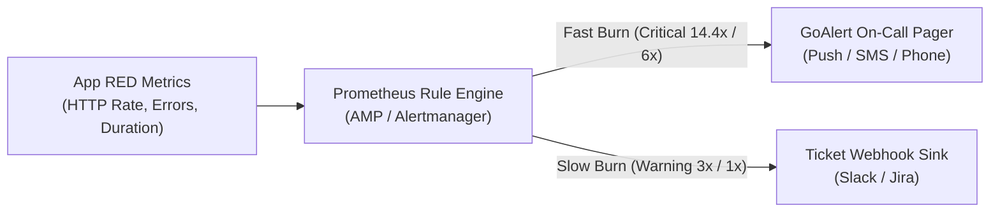

# OpenTelemetry Observability Platform on EKS

A reference enterprise observability platform on Amazon EKS: application teams emit vendor-neutral OTLP telemetry to node-local agents and a central two-tier OpenTelemetry Gateway fleet, while the platform team centrally manages enrichment, sampling, routing, retention, and FinOps costs.

By coupling tail-based sampling, S3 storage tiers, and serverless metric ingestion, this platform slashes observability spend by **70% to 90%** compared to commercial SaaS while eliminating vendor lock-in.

---

## Architecture
Deployable out-of-the-box in **Single-Cluster Mode (default, ~$150/mo)** using namespace and node-pool isolation, or in **Multi-Cluster Peered Mode (~$300/mo)** for regional hub aggregation across peered VPCs.


> 💡 **Multi-Cluster Regional Hub Extension:** For organizations running dozens of Kubernetes clusters or separate AWS accounts, the Gateway exposes an internal AWS Network Load Balancer (NLB) over VPC Peering or AWS Transit Gateway to aggregate regional telemetry into this central cluster without modifying workload code. 👉 *See [docs/architectural-decisions.md#3-cluster-topology-single-cluster-default-vs-multi-cluster-regional-hub](docs/architectural-decisions.md#3-cluster-topology-single-cluster-default-vs-multi-cluster-regional-hub) for the multi-cluster peered architecture diagram and full trade-off analysis.*

### The Telemetry Flow (In 5 Steps)

1. **Multi-Tier Instrumentation:** Go microservice (programmatic OTel SDK) calls a Python service (OTel Operator auto-instrumentation) and propagates W3C trace context, while OBI eBPF captures kernel-level TCP and HTTP metrics non-invasively. Both run pre-built multi-arch images from Docker Hub (`okkarthik/*`).
2. **Node-Local Enrichment:** Pods stream OTLP to their node-local collector via Downward API `status.hostIP:4317` (preserving `k8sattributes` cache locality). The DaemonSet enriches metadata, tails pod logs, and batches telemetry before shipping directly to the gateway via in-cluster CoreDNS (or internal NLB in multi-cluster mode).
3. **Consistent-Hash Gateway Routing:** The Tier 1 Gateway routes traces by `trace_id` consistent hashing to guarantee that all spans of a distributed trace converge on the exact same Tier 2 collector replica.
4. **Platform Policy & Sampling:** The Tier 2 Gateway strips noisy health checks, normalizes HTTP semantic conventions, retains 100% of errors/slow calls while sampling down healthy `200 OK` traces, and applies gzip compression.
5. **Storage & Correlation:**
   - **Metrics:** Streamed via SigV4 remote-write into serverless **Amazon Managed Prometheus (AMP)**.
   - **Traces & Logs:** Exported to **Tempo** and **Loki** on Amazon S3 via **zero-cost S3 Gateway VPC Endpoints** ($0.00/GB data transfer, bypassing NAT Gateways).
   - **Correlation & Paging:** **Grafana** correlates metrics, traces, and logs via `trace_id`; multi-window SLO burn-rate alerts page engineers via **GoAlert**.

---

## 💰 FinOps ROI: Slashing Observability Spend by 70–90%

Traditional SaaS observability vendors (Datadog, Dynatrace, New Relic) bill heavily on raw volume ($1.70–$2.50/M spans, $0.10/GB + $2.50/M logs, $5/100 metrics). In unmanaged environments, **over 95% of the bill is spent indexing repetitive `200 OK` traces and verbose debug logs**.

### Cost Comparison & ROI

| Monthly Telemetry Scale | Commercial SaaS (e.g., Datadog) | OTel Platform on EKS (This Repo) | Monthly Net Savings | Annual Net Savings (% Saved) |
|---|---|---|---|---|
| **Mid Scale** (20 Nodes)<br/>• 10M Requests (~20M Spans)<br/>• 50 GB Logs, 500 Metrics | **~$1,050 / mo**<br/>($12,600 / yr) | **~$310 / mo**<br/>($3,720 / yr) | **+$740 / mo** | **+$8,880 / year**<br/>📉 **70.5% Saved** |
| **Enterprise Scale** (100 Nodes)<br/>• 100M Requests (~500M Spans)<br/>• 1 TB Logs, 5,000 Metrics | **~$8,500 – $12,000+ / mo**<br/>($102k – $144k+ / yr) | **~$780 – $980 / mo**<br/>($9,360 – $11,760 / yr) | **+$7,720 – $11,020+ / mo** | **+$92,640 – $132,240+ / year**<br/>📉 **90.8% – 91.8% Saved** |

### Key FinOps Levers

* **Gateway Tail-Based Sampling:** Retains 100% of errors and latency outliers while sampling healthy traffic down to 5–10%, cutting trace ingestion fees by **80–90%**.
* **S3-Backed Logs & Traces:** Loki and Tempo store immutable chunks directly in Amazon S3 ($0.023/GB) with zero per-event indexing fees, saving **~20× over CloudWatch Logs** ($0.50/GB).
* **Free S3 Gateway VPC Endpoints:** Both VPCs route S3 traffic directly over AWS internal network routes at **$0.00/GB data transfer**, bypassing NAT Gateways ($0.045/GB) and eliminating egress bottlenecks.
* **The "FinOps Firewall" for Existing SaaS:** Even when mandated to retain commercial SaaS, deploying this gateway in-VPC acts as an intelligent firewall, filtering out 90% of healthy noise before external egress to save tens of thousands annually.

### 💡 Architectural FAQ: CloudWatch vs. Loki and When Kafka is Actually Needed

#### Q: "Why not just send EKS logs directly to CloudWatch? It's already built into AWS."
* **The 20× Cost Penalty:** CloudWatch Logs charges **$0.50 per GB** for ingestion. For a modest EKS cluster generating 2 TB to 5 TB of logs/month, CloudWatch costs **$1,000 to $2,500 every month** just to ingest raw log text.
* **The S3 + Loki Advantage:** This platform stores logs in **Grafana Loki backed by S3**:
  - S3 storage costs **$0.023 per GB** with **$0.00/GB ingestion fees**.
  - All log traffic routes over a **Free S3 Gateway VPC Endpoint** at **$0.00/GB data transfer**, completely avoiding NAT Gateway bandwidth charges ($0.045/GB).
  - Result: That same 2 TB log volume drops from **$1,000/month down to ~$46/month** (>95% savings).
* **Sub-Second Correlation:** CloudWatch cannot natively link an OTel `trace_id` from Tempo to its exact matching log line with a single click. Loki and Grafana correlate traces, metrics, and logs out of the box.

#### Q: "Why introduce an optional Kafka buffer? Doesn't it add cost, delays, and complexity?"
* **Direct Ingestion is the Default ($0 extra cost, sub-50ms latency):** In 95% of deployments, OTel Gateways push directly to Loki, Tempo, and AMP with in-memory retry queues. You **do not need Kafka** for standard workloads.
* **When Kafka is Actually Justified (Enterprise Scale):**
  1. **Decoupled SIEM / Compliance Fan-Out:** When a Security Operations Center (SOC) mandates streaming the same log data to both Loki (for developers) AND OpenSearch/Splunk/S3 (for SIEM compliance) without overloading application pods.
  2. **Extreme Outage & Spike Decoupling (>25,000 events/sec):** During S3 maintenance, schema compactions, or sudden Black Friday traffic spikes, an in-memory queue will fill and OTel `memory_limiter` will drop spans. Kafka provides a 24–48 hour durable disk-backed buffer so **zero telemetry is dropped**.
  3. **Summary:** If you don't have multi-destination fan-out or flash surges, **stay with the direct path**. Kafka is an optional, disabled-by-default template for enterprise burst resilience.

---

## 🏛️ Core Platform Capabilities

* **The 4 Levels of Telemetry Instrumentation:** Combines Linux kernel eBPF (catches instant `OOMKilled` Exit 137 and cross-AZ TCP drops), runtime auto-instrumentation (OTel Operator for Python/Java/Node.js stack traces and SQL queries), programmatic Go SDK (`telemetry.go`), and SaaS export. 👉 **[Read the Complete Instrumentation Guide](observability-platform/onboarding/instrumentation-tiers-and-ebpf.md)**.
* **Two-Tier Consistent Hashing:** Solves the distributed tail-sampling challenge by using a stateless router tier to hash `trace_id` to a stateful processor tier, guaranteeing span affinity without data loss.
* **Serverless Metrics with AMP:** Eliminates 10 stateful Mimir pods, cutting cluster memory requests by **~1.9 GiB** with zero pod maintenance toil.
* **Google SRE Multi-Window SLO Alerting:** Evaluates 14.4x, 6x, 3x, and 1x error budget burn rates against RED metrics, paging on-call engineers via GoAlert for critical fast burns and ticket sinks for slow burns:



* **Out-of-Band Meta-Monitoring:** Collector self-telemetry (`:8888`/`:8889`) monitors data drops and backpressure, paired with an external AWS CloudWatch + SNS watchdog for total cluster failure. 👉 **[Read Meta-Monitoring Guide](observability-platform/dashboards-and-alerts/META_MONITORING.md)**.
* **Multi-Tenancy Access Control & Quotas:** Physical S3 prefix partitioning (`X-Scope-OrgID`), Grafana Organizations mapped to corporate SSO, and FinOps stream limits. 👉 **[Read Multi-Tenancy Architecture](docs/multi-tenancy.md)**.

---

## Where Things Live

| Path | Contents | Status |
|---|---|---|
| [`workloads/`](workloads/) | Demo microservices (Go/Python), manifests, and OTel DaemonSet agent | **Deployed** |
| [`observability-platform/`](observability-platform/) | Central OTel Gateway, NLB, Grafana dashboards, GoAlert, and alert sink | **Deployed** |
| [`terraform/`](terraform/) | Single-cluster and multi-cluster EKS, VPC, AMP, S3, and IAM Pod Identity | **Deployed** |
| [`terraform/.../helm-values/`](terraform/observability-cluster/helm-values/) | Loki, Tempo, and Grafana Helm values with inline architectural rationale | **Deployed** |
| [`observability-platform/onboarding/`](observability-platform/onboarding/) | Service onboarding contract, multi-runtime CRs, and Go SDK template | *Contract / Template* |
| [`observability-platform/gateway-policies/`](observability-platform/gateway-policies/) | Multi-tenant routing and tail-sampling budgeting policy templates | *Template* |
| [`observability-platform/dashboards-and-alerts/`](observability-platform/dashboards-and-alerts/) | Golden signals dashboards, PrometheusRule generator chart, and meta-monitoring | *Deployed & Template* |
| [`observability-platform/gitops/`](observability-platform/gitops/) | Argo CD App-of-Apps and regional cluster baseline manifests | *Template* |
| [`docs/`](docs/) | Decisions, multi-tenancy, deployed components inventory, and roadmap | *Documentation* |
| [`.agents/AGENTS.md`](.agents/AGENTS.md) | Agent operational workflows, mental model, and failure traps | *Documentation* |

<details>
<summary>Full tree, annotated with what is deployed and what is a template</summary>

```text
docs/                               # Architectural decisions & traps
  architectural-decisions.md        # 7 core decisions & scale patterns
  deployed-components.md            # Full Helm release & version inventory
  multi-tenancy.md                  # S3 isolation, Grafana Orgs, alerts
  future-roadmap.md                 # AIOps, GenAI APM, IDP, & GitOps
workloads/                          # App-team-owned microservices
  apps-src/
    golang-app/                     # Go SDK programmatic bootstrap
    python-app/                     # Python OTel auto-instrumentation
  k8s-manifests/
    otel-collector-daemonset.yaml   # DEPLOYED  Node agent + OBI eBPF
    golang-app/                     # DEPLOYED  Deployment, Svc, ALB
    python-app/                     # DEPLOYED  Deployment, Svc, CR

observability-platform/             # Platform-team-owned product
  k8s-manifests/                    # DEPLOYED  Core manifests
    otel-collector-gateway.yaml     #   Gateway CR: filters, sampling
    svc-nlb-otel-gateway.yaml       #   Internal NLB ingest router
    grafana-ingress.yaml            #   Internet-facing Grafana ALB
    grafana-dashboards-configmap.yaml
    mimir-ruler-rules-configmap.yaml #  SLO burn-rate rule groups
    alert-sink.yaml                 #   Ticket-severity echo receiver
    goalert.yaml                    #   On-call pager + Postgres
    optional-extensions/            #   TEMPLATE  Optional enterprise tier
      kafka-stub.yaml               #     In-cluster Kafka buffer stub
      opensearch-index-bootstrap-job.yaml # OpenSearch ISM policy
  onboarding/                       # TEMPLATE  Onboarding contracts
    service-onboarding-contract.md  #   Identity & SLO contract
    instrumentation-tiers-and-ebpf.md # 4 levels of instrumentation
    instrumentation-manifests/      #   Multi-runtime CRs & Go SDK
  gateway-policies/                 # TEMPLATE  Policy templates
    otel-gateway-multitenant.yaml   #   Multi-tenant routing connector
    otel-gateway-tail-sampling.yaml #   Tail-sampling rate budgets
  dashboards-and-alerts/
    golden-signals/                 # DEPLOYED  Dashboard JSONs
    helm-chart/                     # TEMPLATE  SLO chart generator
    META_MONITORING.md              #   Meta-monitoring guide
  gitops/                           # TEMPLATE  GitOps baseline
    gitops-app-of-apps/             #   Argo CD root application
    workload-cluster-baseline/      #   Regional gateway aliases

terraform/                          # Cloud infrastructure
  main.tf                           # Multi-cluster entrypoint
  single-cluster/                   # DEPLOYED  Fast single cluster
    main.tf
  apps-workload-cluster-1/          # Workload VPC, EKS, and LB
  observability-cluster/            # Observability VPC, EKS, AMP, S3
    amp.tf                          # Amazon Managed Prometheus
    network.tf                      # VPC, Subnets, S3 VPC Endpoint
    helm-values/                    # Loki/Tempo/Grafana Helm values
    cluster-storage/                # gp3 StorageClass baseline
    karpenter-provisioner/          # Karpenter NodePool & NodeClass
```

</details>

---

## Decisions and Trade-Offs

| Decision | Chosen Approach | Rejected Alternative | Cost of the Choice |
|---|---|---|---|
| **Collector Topology** | DaemonSet agent + central two-tier gateway | Sidecar-per-pod; agent-only | Additional network hop; fleet to operate |
| **Sampling Strategy** | Tail-based sampling at Tier 2 gateway | Head sampling in the SDK | Stateful gateway; trace-ID affinity required |
| **Cluster Layout** | Single-cluster (dev) / Peered multi-cluster (prod) | Single cluster for everything | VPC peering complexity; extra control plane |
| **Telemetry Backends** | Serverless AMP + S3 Loki/Tempo | Self-hosting 10-pod Mimir cluster | AMP charges $0.90/10M samples; zero pod toil |
| **Agent Addressing** | Node-local `status.hostIP` via Downward API | Collector ClusterIP Service | Workloads declare hostIP Downward API block |
| **Log Architecture** | Loki-first (with optional Kafka $\rightarrow$ OpenSearch) | OpenSearch / ELK for everything | Query syntax differences; dual-path maintenance |
| **Alerting & Escalation** | Google SRE SLO burn-rate alerts + GoAlert | App-level alerts; unmaintained Grafana OnCall | Manual initial token bootstrap in GoAlert |

👉 *For deep dives into each choice, upstream Helm chart traps, and operational details, read [Architectural Decisions & Trade-Offs Deep Dive](docs/architectural-decisions.md).*

---

## What Is Not Implemented

Stated plainly, because these read as features if you only skim the directory tree:

- **Multi-tenant routing** — [`otel-gateway-multitenant.yaml`](observability-platform/gateway-policies/otel-gateway-multitenant.yaml) is a template. The deployed gateway currently routes to a single default tenant.
- **The dashboard-and-alert generator chart** — `observability-platform/dashboards-and-alerts/helm-chart/` is a reusable Helm chart generating Kubernetes Prometheus rule definitions. Deployed golden-signal dashboards run directly in Grafana via ConfigMaps.
- **GitOps** — `observability-platform/gitops/` contains an Argo CD app-of-apps pointing at a placeholder repo URL. Deployment is `kubectl apply` from the Makefile.
- **Gateway autoscaling** — the HPA is declared (2–10 replicas at 80% CPU) but no metrics-server is installed by this repo, so it has no metric source. The replica count is effectively fixed at 2.
- **Transport security** — every OTLP hop sets `tls.insecure: true`. The ingest NLB is internal, but the Grafana ALB is internet-facing on plain HTTP with no TLS and no SSO. Fine for a sandbox, not for production.
- **Terraform state** — local only. No remote S3 backend or state locking configured.

---

## How to Run It

### Prerequisites

- AWS credentials with Admin/PowerUser permissions (`aws configure`). Region defaults to `us-east-1`.
- `kubectl` 1.23+, `terraform` 1.5.0+, `helm` 3.x, `python3`.
- Demo application images are publicly hosted on Docker Hub (`okkarthik/*`). No manual image builds or ECR logins are needed.

### Cost Warning

* **Single-Cluster Mode (`SINGLE_CLUSTER=true`, default):** Roughly **~$150/month (~$0.20/hour)**. Uses 1× EKS control plane, 1× NAT gateway, serverless AMP metrics, 2× `t3.large` spot nodes, and free S3 Gateway VPC endpoints.
* **Multi-Cluster Peered Mode (`SINGLE_CLUSTER=false`):** Roughly **~$300/month (~$0.40/hour)**. Uses 2× EKS control planes, 2× NAT gateways, cross-VPC peering, and 2 separate node groups.

`us-east-1` list prices, excluding data transfer; spot prices vary. **Destroy it when you are done.**

### Deploy

```bash
make k8s-create        # two-stage apply in Single-Cluster mode (~$150/mo, fastest)
# OR: make k8s-create SINGLE_CLUSTER=false  # dual-cluster peered topology (~$300/mo)

make k8s-context       # configure kubeconfig contexts
make k8s-deploy-all    # deploy gateway, collectors, and workloads
```

### Access & Verify

```bash
make k8s-dashboards    # port-forward Grafana to http://localhost:3000
make grafana-password  # fetch generated admin password (user: admin)
make k8s-status        # check pod health across namespaces
```

Generate traffic through the demo services:

```bash
# In Single-Cluster mode (default):
ALB=$(kubectl --context observability-platform get ingress app-ingress -o jsonpath='{.status.loadBalancer.ingress[0].hostname}')

# In Multi-Cluster mode:
# ALB=$(kubectl --context apps-workload-cluster-1 get ingress app-ingress -o jsonpath='{.status.loadBalancer.ingress[0].hostname}')

while true; do curl -s "http://$ALB/product" > /dev/null; sleep 1; done
```

### Tear Down

```bash
make k8s-destroy
```

---

## 📦 Deployed Stack at a Glance

* **Metrics Backend:** Amazon Managed Prometheus (AMP) — serverless via AWS SigV4 (zero pod maintenance).
* **Logs Backend:** Grafana Loki (SingleBinary) — native OTLP on Amazon S3 via Free S3 Gateway VPC Endpoints ($0.00/GB data transfer).
* **Traces Backend:** Grafana Tempo (Monolithic) — distributed tracing on Amazon S3 via Free S3 Gateway VPC Endpoints.
* **Unified UI:** Grafana (10.5.15) — single pane of glass linking PromQL, LogQL, and TraceQL.
* **Gateway Fleet:** Central OTel Gateway — Tier 1 consistent-hash router + Tier 2 tail-sampling processor.
* **Node Agents:** OTel Collector DaemonSet (`k8sattributes`, `filelog`) + OBI eBPF (kernel TCP & HTTP RED visibility).
* **Alerting Engine:** GoAlert (on-call pager escalation) + Alert Sink webhook (warning tickets).

👉 *For the full version-pinned Helm release inventory, pod counts, and optional components (Mimir, Kafka, OpenSearch), see **[docs/deployed-components.md](docs/deployed-components.md)**.*

---

## Screenshots

### Go service — golden signals


### Python service — golden signals


### Distributed trace across both services (Tempo)


### Log-to-trace correlation (Loki)

